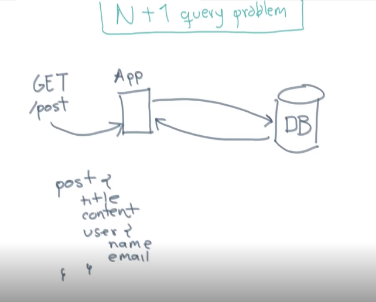

# README

## init Ror project

```bash
# Ejecución en db mysql
rails new . --api -d mysql -T
# Ejecución en db potgresql
rails new . --api -d postgresql -T
 # abrir postgresql 
 # ejecutar rails db:create
```

## ejecution project
```bash
# Servidor
rails s
# Testing Rspec
bundle exec rspec
```

## Install gem's project
```bash
rails webpacker:install
```

## MYSQL DB correction

```bash
# Esto por lo general se instala una sola vez

gem install mysql2 --platform=ruby -- '--with-mysql-lib="C:\mysql-connector\lib" --with-mysql-include="C:\mysql-connector\include" --with-mysql-dir="C:\mysql-connector"'
```

## Generar controlador
```bash
rails g controller Subject index show edit new delete
rails g controller page index show edit new delete

rails destroy controller subject index show edit new delete
```

## Generar Modelos
```bash
rails g model Subject name:string position:integer visible:boolean
rails db:migrate
rails db:seed 
```

## Gemas de Ruby
```bash
rails g rspec:install
```
## Generar Modelos
```bash
rails g model user email name auth_token
rails g model post title content published:boolean user:references
# Migración para Develop
rails db:migrate
# Migración para Test
rails db:migrate RAILS_ENV=test
```

## Generar Controladores
```bash
rails g factory_bot:model user email name auth_token
rails g factory_bot:model post title content published user:references
```
## Generar Serialize
```bash
rails g serializer post 
```
## Generar de devise
```bash
rails g devise:install
rails g devise User
# Pagina de inicio por devise
http://localhost:3000/users/sign_in
http://localhost:3000/users/sign_up
```

## Caso de Uso


## Entidad Relación


## Problema N+1



## Gemas Testing para TDD
